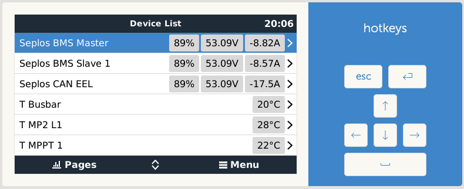
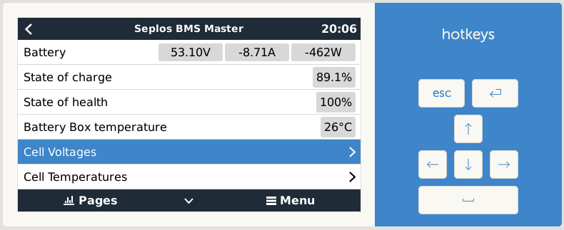
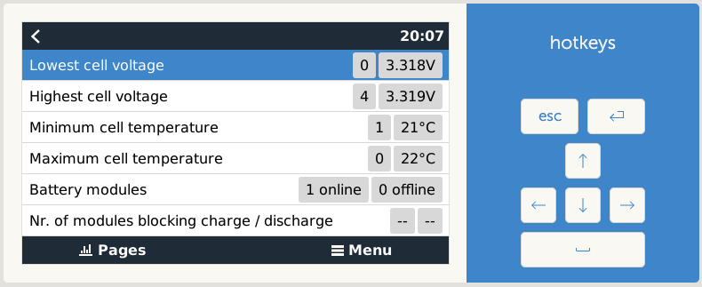
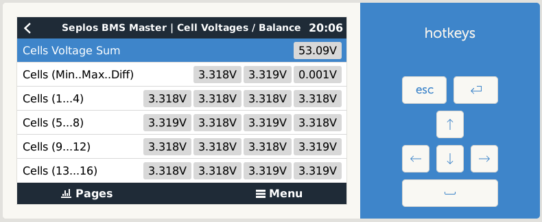
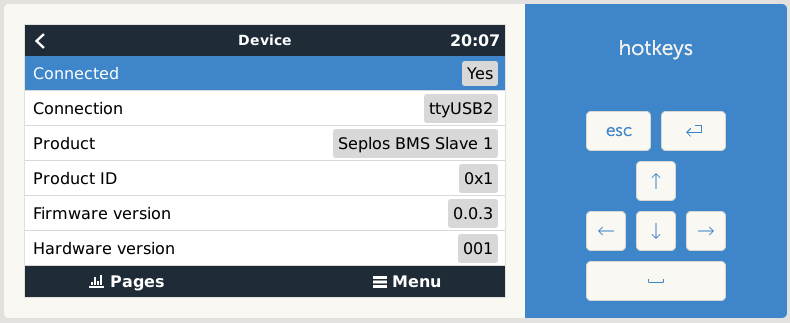

Usage
=====

Once installed and running, the dbus-seplos is shown in the Venus device:

.. image:: image/cell_temp.png
    :align: center
    :scale: 71%

Master and Slave battery packs are defined automatically:

