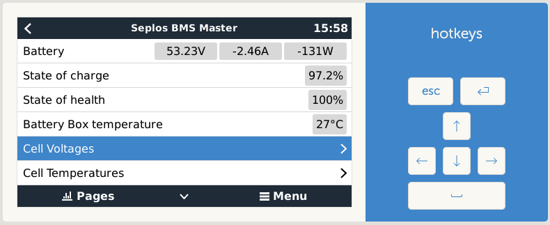

Welcome to dbus-seplos !
========================

The basic idea is that dbus-seplos will generate a second path only readable to
the seplos BMS and try to gather all further detailed information from the BMS
like cell voltages and offer them in dbus of a venus system. Further it will add
and change some venus UI pages to show these information.

This is a driver for Venus OS devices (any GX device sold by Victron or a
Raspberry Pi running the Venus OS image).

.. warning:: Expert functionality! You should be sure about what you are doing.
             I do not take any responsibility for any damage or loss of data.

Content index
^^^^^^^^^^^^
.. toctree::
    :maxdepth: 2

    wiring/index
    installation/index
    usage/index
    problems/index
    changelog/index

Known limitations
-----------------
This driver is developed and tested on a seplos v2 (FW 16.06) and a
Venus GX (FW 3.x). It will not run on Venus OS version lower to 3.0 and does not
support beta versions with the new UI from 3.20 on.

The driver is not tested on a seplos v3 system. There definitely the wiring has
to be adjusted and checked if the driver is working.

The installation of the driver might interfere with other drivers. Especially
having dbus-serial-battery installed at the same time causes conflicts

Reporting issues
----------------
To improve quality and usability any feedback is highly welcome! To maintain a good
transparency and professional work for my, please respect the following
recommendations how to feed back.

.. note:: Please report issues / bugs here:

          https://github.com/mworion/dbus-seplos/issues.

          And if you have feature requests discussions or for all other topics of
          interest there is a good place to start here:

          https://github.com/mworion/dbus-seplos/discussions

In case of a bug report please have a good description (maybe a screenshot if it‘s
related to GUI) and add the log file(s). Normally you just could drop the log file
(or PNG in case of a screen shot) directly to the webpage issues on GitHub. In
some cases GitHub does not accept the file format. In this case, please zip them
and drop the zipped file. This will work. If you have multiple files, please
don‘t zip them to one file! I need them separated and zipped causes more work.

If changes are made due to a feedback, new releases will have a link to the closed
issues on GitHub.
