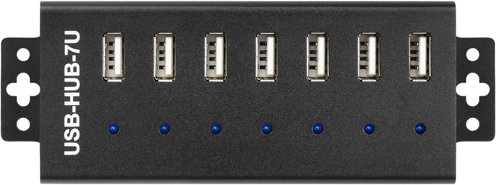
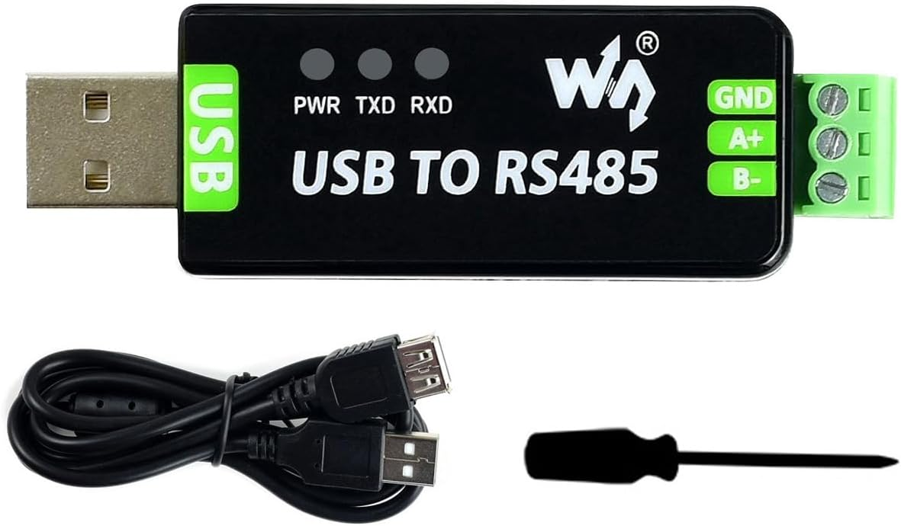
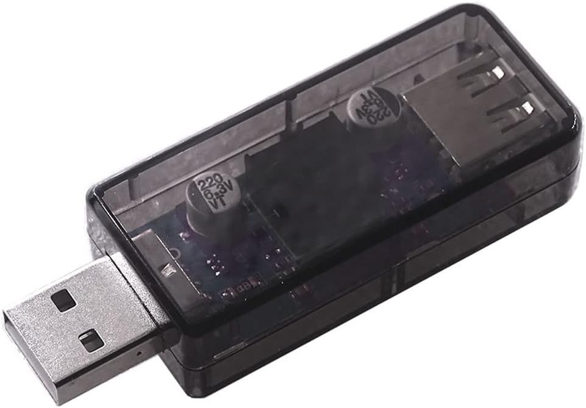
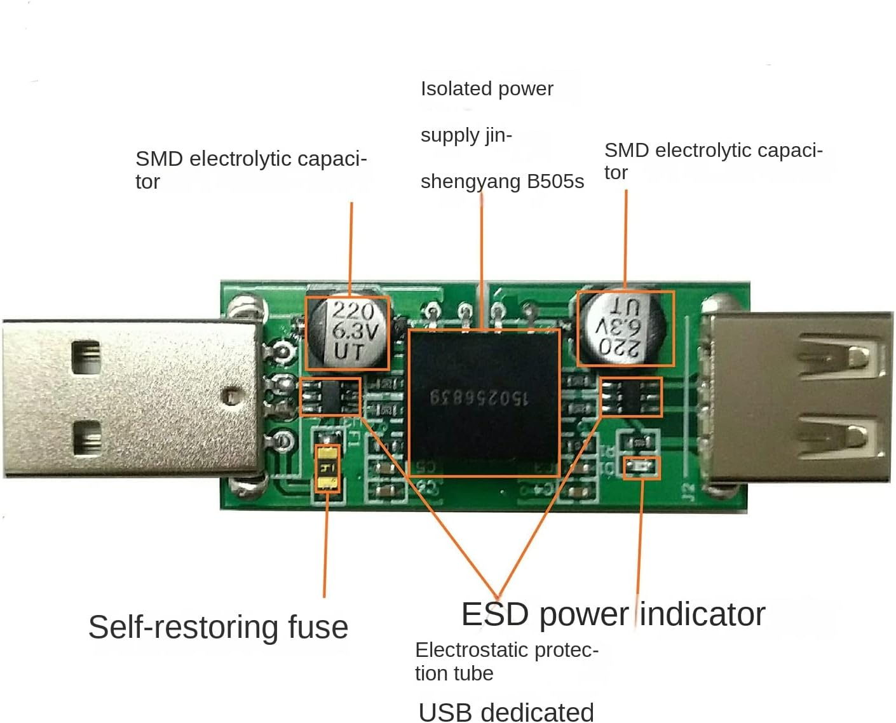
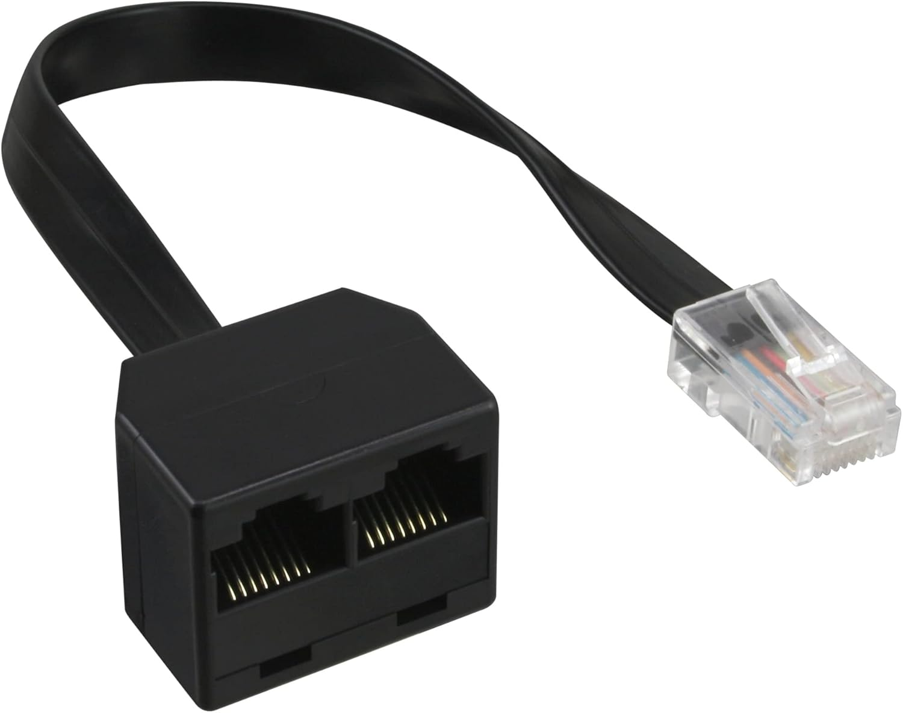
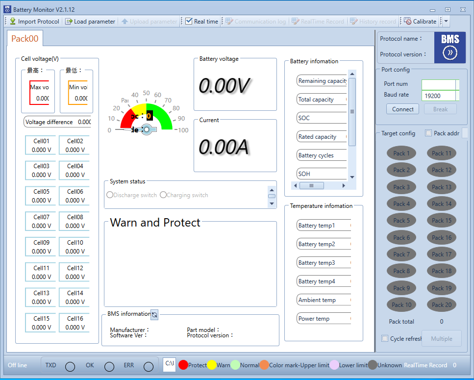

Problem solving
===============
Attached to this document you will find a list of common problems that you may use
for troubleshooting. If you have any other problem that is not listed here, please
contact my through github issues

Device setup
------------
The following devices are used in my setup:

Waveshare USB-HUB-7U-NP

Waveshare RS232/485 USB All

Ocnvlia ADUM3160 USB Isolatormodul USB zu USB Spannungsisolatormodul

InLine 69933 ISDN Splitter

The wiring is done from Cerbo GX to the Isolator Module, the USB-HUB-7U-NP, then to
the USB - RS485 converter and finally to the splitter and RS-485 port of the
master battery pack. The CAN interface is connected to the splitter of the master
battery pack as well directly from Cerbo.

Checking Connectivity
---------------------
Before you start investigating the problem, you should check the connectivity
of the devices. You can use the Battery Monitor of Seplos to check if each
connection is working properly.

Please take into account that the master pack (connected through the splitter)
runs on 9600m baud rate, while the slave pack (connected through the RS-485 port
of the master pack) runs on 19200 baud rate.

You should be able to see each pack separately when using the dedicated USB-RS485
converter. dbus-seplos later on chooses the correct port and speed for each pack.

Checking the logs
-----------------
You can check the logs of dbus-seplos to see if there are any errors or warnings.
The location of the logs is in the following path:

/var/log/dbus-seplos.ttyUSBxy

where xy is the number of the USB port where the device is connected.
