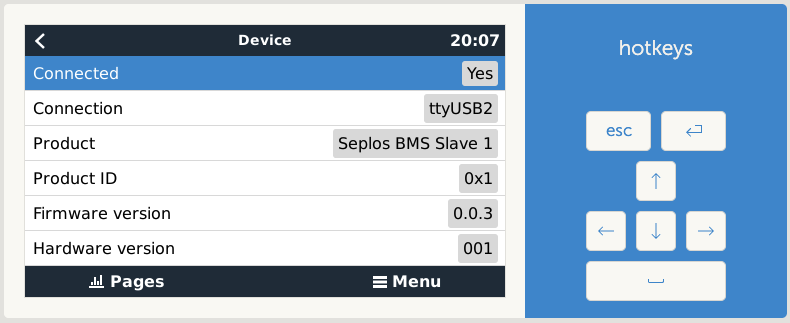

Usage
=====

Once installed and running, the dbus-seplos is shown in the Venus device beside
the CAN driver, which handles all active topics. dbus-seplos does not write or
actively change values. Just transferring BMS data to dbus.

.. image:: image/overview.png
    :align: center
    :scale: 71%

.. image:: image/standard.png
    :align: center
    :scale: 71%

.. image:: image/details.png
    :align: center
    :scale: 71%

.. image:: image/cell_voltages.png
    :align: center
    :scale: 71%

.. image:: image/cell_temps.png
    :align: center
    :scale: 71%

Master and Slave battery packs are defined automatically:

.. image:: image/device_master.png
    :align: center
    :scale: 71%

